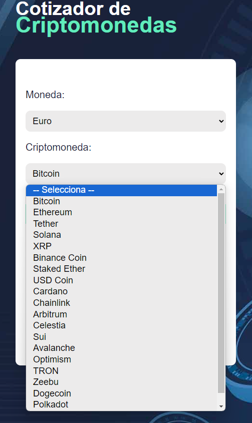

# CotizadorCrypto
Es un proyecto realizado con VueJs el cual permite seleccionar una de las 20 criptomonedas más cotizadas y una moneda: te devuelve mediante la API de CryptoCompare  el valor del mercado actual y distintos parámetros. Datos actualizados.

## Conceptos Técnicos
API de CryptoCompare [URL](https://min-api.cryptocompare.com/documentation?key=Toplists&cat=TopTotalMktCapEndpointFull)

Usamos un composale useCritpo() el cual contiene toda la logicas
El App.vue solo dejamos un reactive en forma de objeto que recoge los datos del formulario inicial (Moneda y Critpo) para mandarlo al useCritpo que hace la conexion con la API y devuelve los datos

```import {ref, onMounted, computed} from 'vue'

export default function useCripto() {

    const monedas = ref([
        { codigo: 'USD', texto: 'Dolar de Estados Unidos'},
        { codigo: 'MXN', texto: 'Peso Mexicano'},
        { codigo: 'EUR', texto: 'Euro'},
        { codigo: 'GBP', texto: 'Libra Esterlina'},
    ])

    const criptomonedas = ref([])
    const cotizacion = ref({})
    const cargando = ref(false)

    onMounted( () => {
        const url = 'https://min-api.cryptocompare.com/data/top/mktcapfull?limit=20&tsym=USD'
        fetch(url)
            .then(respuesta => respuesta.json())
            .then(data =>{
            criptomonedas.value=data.Data
            })
    })

    const obtenerCotizacion  = async (cotizar) =>{
        cotizacion.value={}
        cargando.value = true
        const {moneda, criptomoneda} = cotizar
        const url = `https://min-api.cryptocompare.com/data/pricemultifull?fsyms=${criptomoneda}&tsyms=${moneda}`
        
        const respuesta = await fetch(url)
        const data = await respuesta.json()
    
            setTimeout( () => {
            cotizacion.value=data.DISPLAY[criptomoneda][moneda]
            cargando.value = false
            },500)
          // Se indica con [] para hacerlo dinamico y mostrar los valores 
          // se usa . cuando es un nombre fijo, por ejemplo, si siempre fuera BTC, seria data.DISPLAY.BTC[moneda ] y moneda iria cambiando
    }

    const mostrarResultado = computed( () => {
        return Object.values(cotizacion.value).length > 0
    })

    return {
        monedas,
        criptomonedas,
        cargando,
        cotizacion,
        mostrarResultado,
        obtenerCotizacion
    }
}
```

## Primera Vez que uso este spinner
[Enlace del proyecto](https://tobiasahlin.com/spinkit/)
Creamos Spinner.vue para usarlo con este código

```
<template>
<div class="spinner">
  <div class="bounce1"></div>
  <div class="bounce2"></div>
  <div class="bounce3"></div>
</div>

</template>
<style scoped>

.spinner {
  margin: 100px auto 0;
  width: 70px;
  text-align: center;
}

.spinner > div {
  width: 18px;
  height: 18px;
  background-color: #333;

  border-radius: 100%;
  display: inline-block;
  -webkit-animation: sk-bouncedelay 1.4s infinite ease-in-out both;
  animation: sk-bouncedelay 1.4s infinite ease-in-out both;
}

.spinner .bounce1 {
  -webkit-animation-delay: -0.32s;
  animation-delay: -0.32s;
}

.spinner .bounce2 {
  -webkit-animation-delay: -0.16s;
  animation-delay: -0.16s;
}

@-webkit-keyframes sk-bouncedelay {
  0%, 80%, 100% { -webkit-transform: scale(0) }
  40% { -webkit-transform: scale(1.0) }
}

@keyframes sk-bouncedelay {
  0%, 80%, 100% { 
    -webkit-transform: scale(0);
    transform: scale(0);
  } 40% { 
    -webkit-transform: scale(1.0);
    transform: scale(1.0);
  }
}
</style>

```

## Imágenes:




